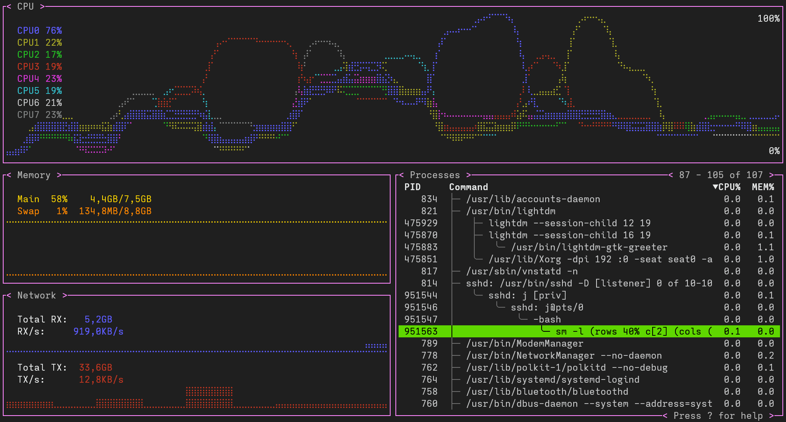

# system_monitor

A terminal based graphical system monitor, inspired by [gotop](https://github.com/cjbassi/gotop).



## Building

```
git clone https://github.com/JaMo42/system_monitor
cd system_monitor
git submodule init
git submodule update
make
```

Note: by default the program links with the `-lncurses` library but on some systems you may need to change it to `-lncursesw` (happens automatically on debian-based distros).

## Usage

### Command-line options

- `-a` show average CPU usage
- `-r rate` update rate in milliseconds
- `-c` always show CPU graph in range 0~100%
- `-f` ASCII art process tree (like the `--forest` option for `ps`)
- `-l layout` specifies the [layout](#layout)
- `-T` show kernel threads
- `-t name` specifies the theme, using this will disable all the theme settings from the configuration
- `-h` show help message

If the layout option for `-l` is `?` the current layout string (either the default or the `SM_LAYOUT` environment variable) gets printed.

### Keybindings

- `q`: Quit
- Process navigation
  - `k` and `<Up>`: up
  - `j` and `<Down>`: down
  - `K`: up by 5
  - `J`: down by 5
  - `g`: jump to top
  - `G`: jump to bottom
- Process sorting
  - `c`: sort by CPU usage (default)
  - `m`: sort by memory usage
  - `p`: sort by PID

  Selecting the same sorting mode again toggles between descending and ascending sorting.

- Space/Enter: Open the context menu for the currently selected process
- `f`: toggle process ASCII art tree view
- `t`: collapse/expand the selected tree
- `T`: toggle visibility of kernel threads
- `S`: toggle summation of child processes
- Process searching
  - `/`: start search
  - `n`: select next search result
  - `N`: select previous search result
- CPU graph
  - `a`: toggle average CPU usage
  - `C`: toggle CPU graph range scaling
- Context menus
  - `k` and `<Up>`:  up
  - `j` and `<Down>`: down
  - `<Space>` and `<Enter>`: confirm
  - anything else: cancel
- `R`: Reload the theme from the configuration

These can be viewed while the application is running by pressing `?`.

### Mouse control

Process viewer:

If the mouse cursor is above the process viewer the scroll wheel moves the process cursor.
Clicking the `PID`, `CPU%`, or `MEM%` headers chooses that sorting mode or toggles between descending and ascending sorting.
Clicking a process selects that process, clicking the selected process again opens the context menu.
Clicking a item in the context menu selects it, clicking outside the menu cancels it.
The context menu should also highlight the element under the cursor however this may not work in some terminals.

## Configuration

### File

The is configured using the file `~/.config/sm.ini`.

Sections and their properties are:

- `sm`
  - `layout` (string) the layout string or name of a named layout
  - `interval` (number) the update interval
  - `graph-scale` (number) the graph scale

- `cpu`
  - `show-average` (bool) show the average CPU usage instead of each processor
  - `scale-heigh` (bool) show only required height instead of 0 to 100 percent

- `proc` (process viewer)
  - `forest` (bool) enable forest mode
  - `kthread` (bool) show kthreads

- `disk`
  - `vertical` (bool) if true, show filesystems in a column
  - `mounting-points` (string) comma separated list of mounting points of the filesystems to show

- `temp`
  - `filter` (string) comma or semicolon separated whitelist of temperature zones (like `thermal_zone0`) or types (like `acpitz`) to show.
  If empty (the default) zones are not filtered.
  Example: `acpitz,thermal_zone1,thermal_zone2` is equivalent to `acpitz;thermal_zone1;thermal_zone2`.
  - `show-average` (bool) show the average of all zones

- `battery`
  - `battery` (string) the battery to display (one of the directories from /sys/class/power_supply).
    The default is `BAT0`.
  - `slim` (bool) if true, use 1 as minimum height instead of 3.
    Note: I recommend always setting the size of the battery widget in the layout to 0% to enforce the minimum size.
  - `show_status` (string) comma separated list of battery statuses to show.
    The default is `Charging,Not charging`.
    See the `/sys/class/power_supply/<supply_name>/status` section here for valid values: https://www.kernel.org/doc/Documentation/ABI/testing/sysfs-class-power.

- `theme`
    - `theme` (string) name of builtin theme to use as a base, the other fields in this section override colors in that theme, see `THEME.md`.

- `layouts`
    The keys in the section are names that map to the layout in their value.
    The values may also be the names of other named layouts so aliases can be created.
    See [Named Layouts](#named-layouts) for more info and an example.

Boolean values can be given as `true`, `yes`, or `1` for true and `false`, `no`, or `0` for false.

Number values are unsigned integers.

String values may be quoted.

### Graph shapes

The graph shape of the `cpu`, `memory`, and `network` widgets can be configured using these options inside their section:

- `graph-kind` (string) one of:
    - `straight`, `line` straight lines between data points (default for `network`)
    - `bezir`, `curve` bezir curves between data points (default for `cpu`)
    - `blocks`, `block` draw data points as blocks (default for `memory`)

- `graph-scale` (number) horizontal graph scale (default is `8`)

### Environment variables

- `SM_DISK_FS`: disk filesystems string; comma-separated list of mounting points

- `SM_DISK_VERTICAL`: if set, the disk usage widget is displayed vertically

### Precedence

The precedence for the different configuration ways is:

- default value

- config file

- environment variable

- commandline option

## Layout

A custom layout can be specified via the `-l` argument.

If not specified the default is `(rows 33% c[2] (cols (rows m[1] n[0]) p[3]))`.

Another example: `strict (cols 66% cpu[3] (rows 33% mem[1] (rows net[0] proc[2])))`.

Can also be a single widget: `cpu`.

### Named layouts

The layout string provided on the command line or in the configuration may also be the name of a named layout which is defined in the `layouts` section of the configuration or is one of the builtin layouts:

- `default` The default layout that will be used if no layout is specified anywhere
- `full` A layout containing all widgets

Command line example: `sm -l full`

Configuration example:
```
[layouts]
longname = "strict (cols 66% cpu[3] (rows 33% mem[1] (rows net[0] proc[2])))"
ln = longname
```

### Syntax

```
layout-string: ["strict"] (layout | widget-name)
layout:        "(" shape [percent-fist] child child ")"
shape:         rows | cols
rows:          "rows" | "horizontal"
cols:          "cols" | "columns" | "vertical"
percent-first: <number> "%"
child:         widget | layout
widget:        widget-name "[" priority "]"
widget-name:   "cpu" | "memory" | "network" | "processes" | "disk_usage" | "temperature" | "battery"
priority:      <number>
```


`percent-first` is the relative size of the first child of the layout (top for rows, left for columns). If omitted it defaults to 50%, if the given value is greater than 100% it becomes 100%.

The `widget-name` can be abbreviated to any length as long as it's not ambiguous.

The `priority` is used to decide which widgets to hide first when the window is too small.

If the entire layout string is prefixed by `strict`, automatic widget resizing gets disabled.

### Small window sizes

If the window is too small to fit all widgets at their preferred relative size it tries to change the relative size of widgets to fit all of them (unless the layout string starts with `strict`).

If it still can't fit all of them it hides some based on their priority (lower priority means they get hidden first).

If no widget fits it just displays `Window too small`.
